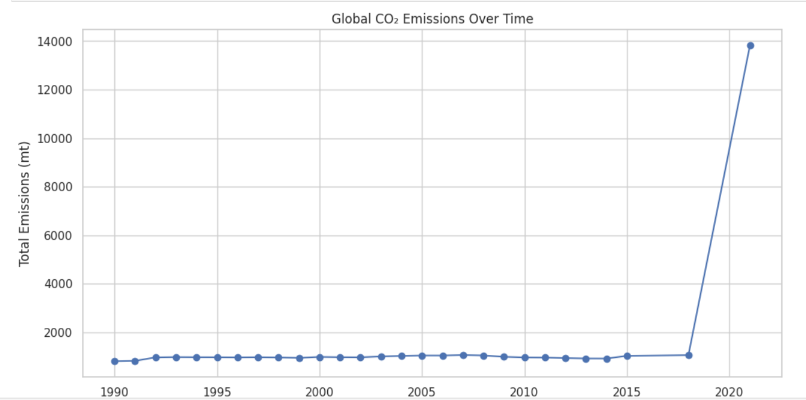
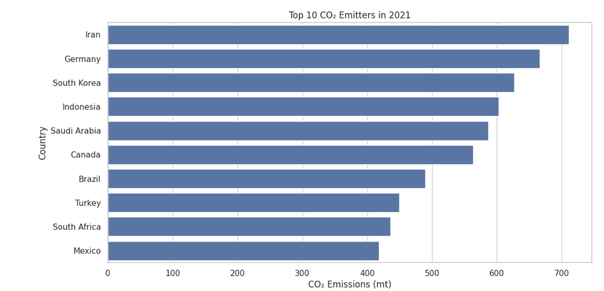
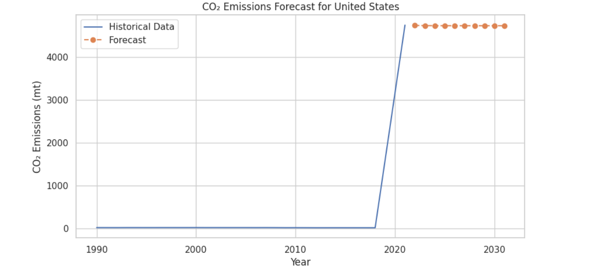

# README: Forecasting CO₂ Emissions with ARIMA

## Project Overview
This project aims to analyze and forecast CO₂ emissions for various countries using the ARIMA (AutoRegressive Integrated Moving Average) model. The analysis primarily focuses on the United States to demonstrate the methodology and results. The project involves data preprocessing, exploratory data analysis, model fitting, and forecasting.

---

## Dataset Details
- **Source:** A dataset containing CO₂ emission rates (in metric tons) for multiple countries over several years.
- **Key Attributes:**
  - `Country`: Name of the country.
  - `Year`: The year of measurement (e.g., 1990, 2000).
  - `CO2EmissionRate (mt)`: CO₂ emission rates in metric tons (may contain missing values or formatting inconsistencies).

---

## Analysis Steps
### Data Preprocessing
1. **Date Conversion:**
   - Converted the `Year` column to a datetime format for time series analysis.
   - Set the `Year` column as the index.

2. **Data Cleaning:**
   - Replaced missing values (`-`) with `NaN`.
   - Removed formatting (commas) from numeric values.
   - Converted `CO2EmissionRate (mt)` to numeric values.

3. **Country-Specific Filtering:**
   - Selected data for the United States to illustrate the forecasting process.
   - Sorted by year and dropped rows with missing CO₂ emission values.

---

### Model Selection and Training
- Checked for **stationarity** in the data using the Augmented Dickey-Fuller (ADF) test.
  - Applied differencing to achieve stationarity if necessary.
- Trained an ARIMA model with parameters `(1, 0, 1)` on the training data.
- Forecasted CO₂ emissions for the last 5 years (test set).

### Error Metrics
- **Mean Absolute Error (MAE):** 96.57
- **Root Mean Squared Error (RMSE):** 116.15

---

## Results
### Visualizing Predictions
The predictions were compared with actual values for the test period. A plot of the results is shown below:

### Visualizing Data Preprocessing
Here is a snapshot of the preprocessing steps and cleaned data:

### Model Fitting and Forecasting
This visualization highlights the model fitting and forecasting process:

---

## Key Insights
1. The ARIMA model effectively captures trends in CO₂ emissions, though the error metrics indicate room for improvement.
2. Proper preprocessing and ensuring stationarity are critical for accurate forecasting in time series data.

---

## Future Improvements
1. **Hyperparameter Tuning:** Experiment with different ARIMA parameters and automated selection techniques like grid search.
2. **Expand Analysis:** Include other countries and analyze regional trends in CO₂ emissions.
3. **External Factors:** Incorporate external predictors (e.g., GDP, population) into the model for enhanced accuracy.

---

## How to Reproduce the Analysis
1. Use the provided dataset (`tidy_format_co2_emission_dataset.csv`).
2. Follow the steps outlined in the code to preprocess and train the model.
3. Visualize and evaluate the predictions with the provided metrics.

---

## References
1. Dataset preprocessing and cleaning techniques were informed by general data science best practices.
2. Time series modeling and ARIMA implementation were guided by "Time Series Analysis" by Rob J Hyndman.

---

## Contact
For any questions or suggestions, please reach out to me.

---

